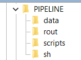
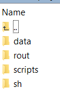

# Deconvolution-PIPELINE
---

## About PIPELINE
Benchmarking of cell type deconvolution pipelines for transcriptomics data uses five single-cell RNA-sequencing (scRNA-seq) datasets and generates pseudo-bulk mixtures to evaluate the combined impact of these factors. Pipeline generates the reference matrices for the deconvolution, selects Cell-type specific marker, generates thousands of artificial pseudo-bulk mixtures, evaluates deconvolution pipelines with real RNA-seq data, transfers and normalizes the data, easures of deconvolution performance, and evaluates of missing cell types in the reference matrix. To run the code you should first set arguments according to the pipeline Git Hub as follow:
i) a specific dataset (from "example","baron","GSE81547","E-MTAB-5061","PBMCs")
	ii) data transformation (from "none","log","sqrt","vst"); with "none" meaning linear scale
	iii) type of deconvolution method (from "bulk","sc")
		iii.1) For "bulk" methods:
			iii.1.1) choose normalization method among: "column","row","mean","column_z-score","global_z-score","column_min-max","global_min-max","LogNormalize","QN","TMM","UQ", "median_ratios", "TPM"
			iii.1.2) Marker selection strategy from "all", "pos_fc", "top_50p_logFC", "bottom_50p_logFC", "top_50p_AveExpr", "bottom_50p_AveExpr", "top_n2", "random5" (see main manuscript for more details).
			iii.1.3) choose deconvolution method among: "CIBERSORT","DeconRNASeq","OLS","nnls","FARDEEP","RLR","DCQ","elastic_net","lasso","ridge","EPIC","DSA","ssKL","ssFrobenius","dtangle".

		iii.2) For "sc" methods:
			iii.2.1) choose normalization method for both the reference matrix (scC) and the pseudo-bulk matrix (scT) among: "column","row","mean","column_z-score","global_z-score","column_min-max","global_min-max","LogNormalize","QN","TMM","UQ", "median_ratios", "TPM", "SCTransform","scran","scater","Linnorm" (last 4 are single-cell-specific)
			iii.2.2.) choose deconvolution method among: "MuSiC","BisqueRNA","DWLS","deconvSeq","SCDC"

	iv) Number of cells to be used to make the pseudo-bulk mixtures (multiple of 100)
	v) Cell type to be removed from the reference matrix ("none" for the full matrix; this is dataset dependent: e.g. "alpha" from baron dataset)
	vi) Number of available cores (by default 1, can be enlarged if more resources available)

-The original code can be found here: https://github.com/favilaco/deconv_benchmark
-R statistical programming language, v3.6 (R >= 3.6.0)

~~~

---
## Directory Layout


We assume the user set the default directory at **beluga** at Compute Canada
~~~
    [PIPELINE]  
~~~
all codes are in the subdirectory directory at **scripts** 
~~~
    [PIPELINE]/scripts  
~~~
all the .sh files that run the R files are in the subdirectory directory at **sh** 
~~~
    [PIPELINE]/sh  
~~~
all the log files are in the subdirectory directory at **rout** 
~~~
    [PIPELINE]/rout  
~~~
all the final results/intermedia results are in the subdirectory directory at **result** 
~~~
    [PIPELINE]/outputs  
~~~
all the **datasets** from Schelker are stored at the directory bellow, which are accessible to all group members
~~~
    [PIPELINE]/data  
~~~

<details><summary>scripts</summary>

    ├── scripts
    │ 	 ├── helper_functions.R		# The functions to generate the psudo bulk, true propotions and doing deconvolution 
    │ 	 └── PIPELINE.R		# The main script 			 				
</details>
<details><summary>sh</summary>

    ├── sh	
    │ 	 └── pipeline.sh		# sh.file to get the deconvolution results				
	
</details>
<details><summary>rout</summary>

    ├── log files after submitting jobs
    │ 	 └── pipeline.rout		# log file for pipeline.sh	

</details>
<details><summary>outputs (final & intermedia results)</summary>

    ├──  final result 
    │ 	 ├── RMSE			# The final prediction results 
    │ 	 └── Pearson		# Pearson correlation between estimated and true proportion
</details>
<details><summary>data</summary>

    ├── data  
    │ 	 ├── scRNAseq_7873_schelker.rds	   
    │ 	 ├── scRNAseq_7882_schelker.rds	
    │ 	 ├── scRNAseq_7892_schelker.rds	
    │ 	 ├── p12_phenoData.txt	   
    │ 	 ├── p13_phenoData.txt	
    │ 	 ├── p32_phenoData.txt	
    │ 	 └── bulk-schelker.tsv 		

</details>

---
## Notice

As all the processes are conducted using the relative path, it's very important to set up [PIPELINE] and use it correctly. 
[PIPELINE] should be consisted of three parts: part 1 is ```/project/6003851/``` to ensure all the files can run on Compute Canada; part 2 is your ```user name``` at Compute Canada; part 3 is your ```folder's name```. For example, the writer's directory is as follows:

~~~
/project/6003851/elhma/PIPELINE
~~~

If you are not sure about the path of your working folder, try to type in 'pwd' command in linux or 'getwd()' in R language for reference. 

---
## Before you start
1. decide the path of [PIPELINE] to replicate our results;
2. create the subdirectories **scripts**, **sh**, **rout**, and **outputs** at [PIPELINE]；
3. allocate all relevant files into each subdirectory. The **rout**, and **outputs** folders will be empty at the beginning while the **scripts**, **data** and **sh** folders should look like the figure below:



5. In the main directory [PIPELINE], use the following commands to load R/4.0.2 language in Compute Canada (The environment settings in CC change occasionally, make sure to check and use their latest settings):
~~~
module load gcc/9.3.0 r/4.0.2
mkdir -p ~/.local/R/$EBVERSIONR/
export R_LIBS=~/.local/R/$EBVERSIONR/
~~~
4. before we run the .sh files, we use in the following commands in to install some packages needed for the task
~~~
#packages required in R:
packages <- c("devtools", "BiocManager","data.table","ggplot2","tidyverse",
			  "Matrix","matrixStats",
			  "gtools",
			  "foreach","doMC","doSNOW", #for parallelism
			  "Seurat","sctransform", #sc-specific normalization
			  "nnls","FARDEEP","MASS","glmnet","ComICS","dtangle") #bulk deconvolution methods

for (i in packages){ install.packages(i, character.only = TRUE)}

#Installation using BiocManager:
#Some packages that didn't work with install.packages (e.g. may not be present in a CRAN repository chosen by the user)
packages3 = c('limma','edgeR','DESeq2','pcaMethods','BiocParallel','preprocessCore','scater','SingleCellExperiment','Linnorm','DeconRNASeq','multtest','GSEABase','annotate','genefilter','preprocessCore','graph','MAST','Biobase') #last two are required by DWLS and MuSiC, respectively.
for (i in packages3){ BiocManager::install(i, character.only = TRUE)}

#Dependencies for CellMix: 'NMF', 'csSAM', 'GSEABase', 'annotate', 'genefilter', 'preprocessCore', 'limSolve', 'corpcor', 'graph', 'BiocInstaller'
packages2 = c('NMF','csSAM','limSolve','corpcor')
for (i in packages2){ install.packages(i, character.only = TRUE)}

#Special instructions for CellMix and DSA
install.packages("BiocInstaller", repos="http://bioconductor.org/packages/3.7/bioc/")
system('wget http://web.cbio.uct.ac.za/~renaud/CRAN/src/contrib/CellMix_1.6.2.tar.gz')
system("R CMD INSTALL CellMix_1.6.2.tar.gz")
system('wget https://github.com/zhandong/DSA/raw/master/Package/version_1.0/DSA_1.0.tar.gz')
system("R CMD INSTALL DSA_1.0.tar.gz")

#Following packages come from Github
devtools::install_github("GfellerLab/EPIC", build_vignettes=TRUE) #requires knitr
devtools::install_github("xuranw/MuSiC") 
devtools::install_bitbucket("yuanlab/dwls", ref="default")
devtools::install_github("meichendong/SCDC")
devtools::install_github("rosedu1/deconvSeq")
devtools::install_github("cozygene/bisque")
devtools::install_github("dviraran/SingleR@v1.0")
~~~

---

## Running files 

<details><summary>1. PIPELINE.R </summary>

- set the 9 arguments including the deconvolution method, Bulk or SC method, Number of cells to be used to make the pseudo-bulk mixtures, Cell type to be removed from the reference matrix, Number of available cores;
- generates pseudo-bulk mixtures using helper_functions.R;
- predict the estimated proportion;
- compute RMSE and Pearson correlation between true and estimated propostion;

 </details>
 
 ~~~
    sbatch ./sh/pipeline.sh


